# OpenKore Architecture Atlas

This document provides a visual architecture map of OpenKore.

Each section contains Mermaid diagrams representing important subsystems and execution flows.  
The goal is to help the assistant reason about the internal structure and runtime behavior of OpenKore.

---

# System Overview

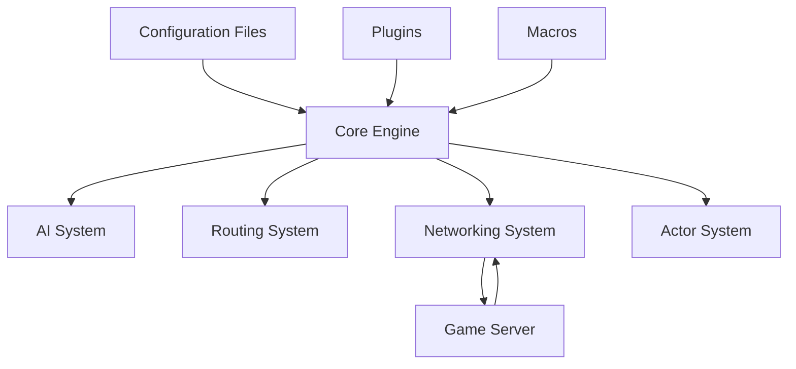

Explanation:

OpenKore is structured around a core engine that connects multiple subsystems:

- AI system
- networking system
- routing system
- actor system

Plugins, macros, and configuration files extend or modify behavior.

---

# AI Execution Loop

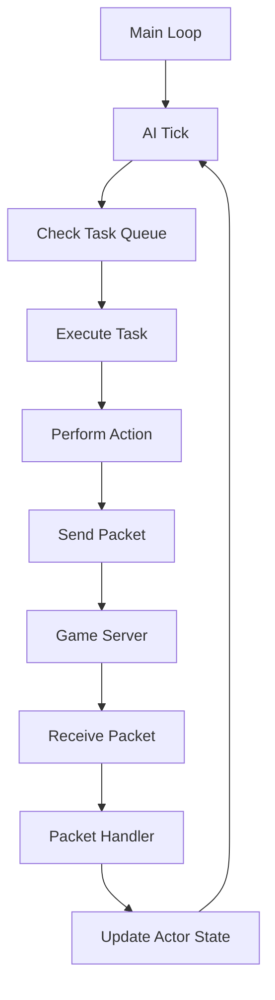

Explanation:

The AI loop continuously:

1. processes AI tasks
2. performs actions
3. communicates with the server
4. updates world state.

---

# Networking Pipeline

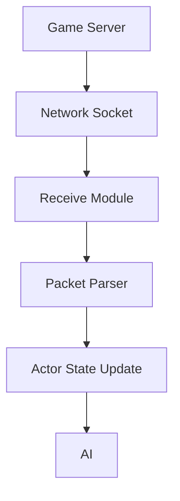

Explanation:

The networking subsystem receives packets from the server and converts them into game state updates used by the AI.

---

# NPC Interaction Flow

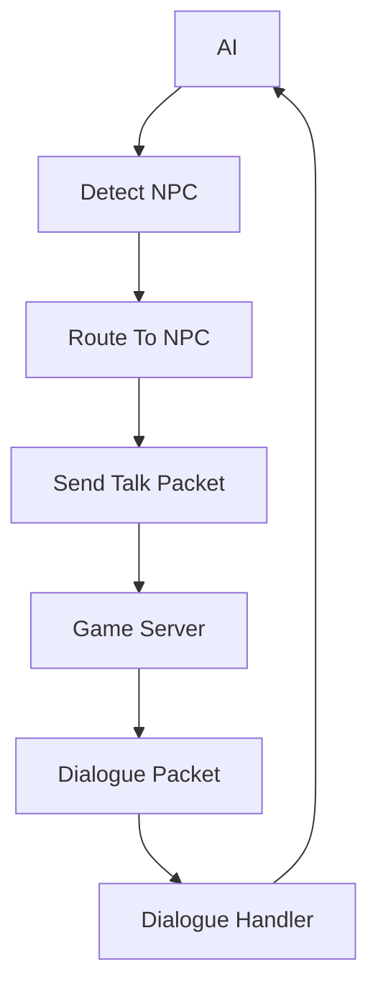

Explanation:

NPC interaction involves:

1. detecting NPC location  
2. routing to the NPC  
3. sending interaction packets  
4. processing dialogue responses.

---

# Plugin System

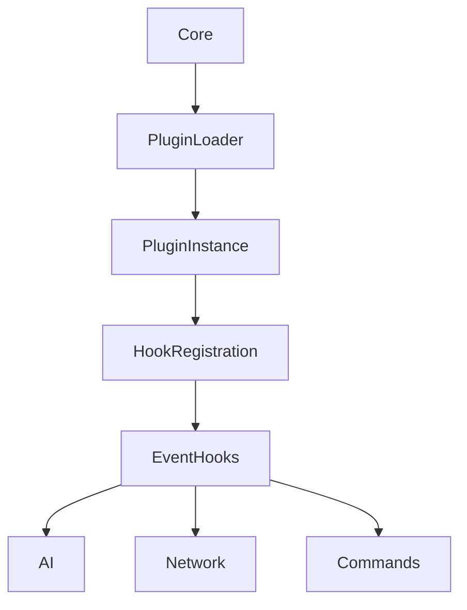

Explanation:

Plugins extend OpenKore by registering hooks that listen to events generated by different subsystems.

---

# Macro System

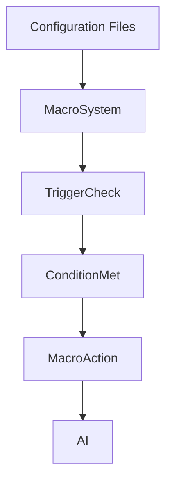

Explanation:

Macros allow users to define automated behaviors triggered by conditions.

---

# Routing and Movement

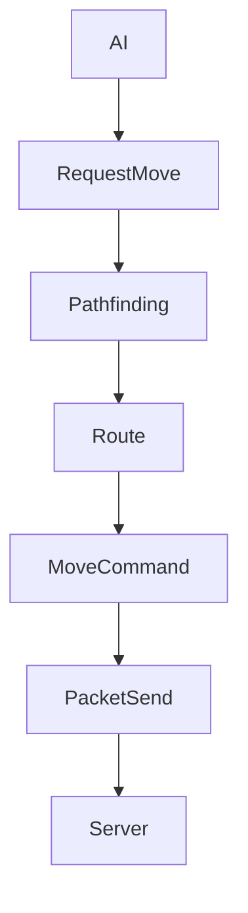

Explanation:

Routing calculates paths between coordinates and sends movement packets to the server.

---

# Actor State Updates

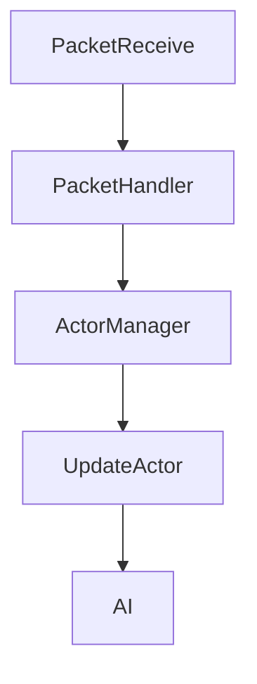

Explanation:

Actors represent entities in the game world such as players, monsters, and NPCs. Their state is updated based on received packets.

---

# Command Processing

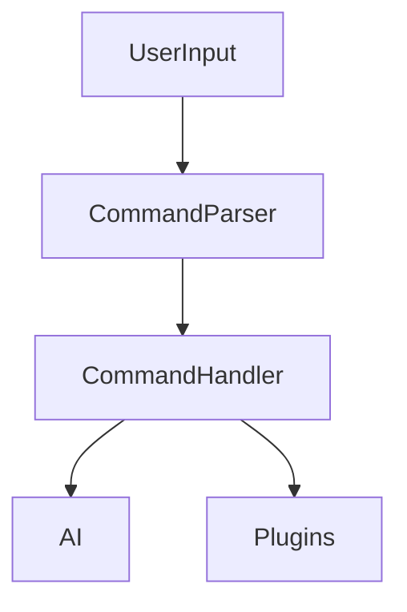

Explanation:

Commands can be entered through the console or triggered by macros and plugins.

---

# Configuration Loading

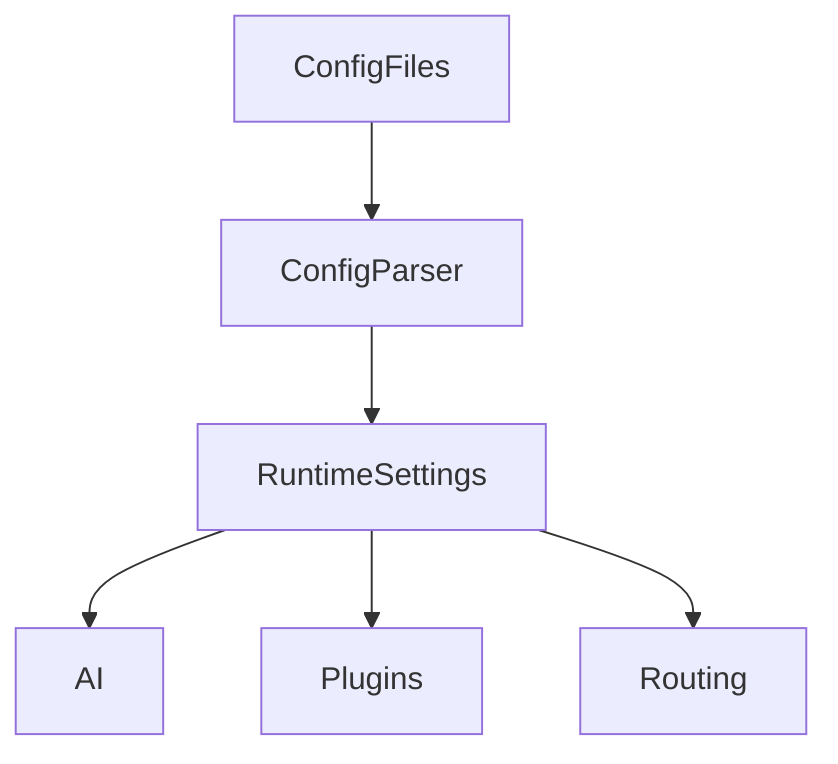

Explanation:

Configuration files define runtime behavior and influence multiple subsystems.

---

# Task System

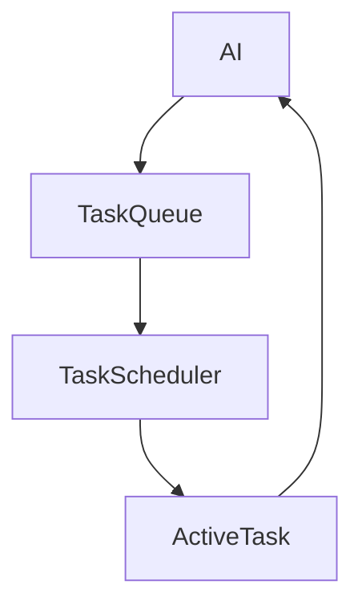

Explanation:

The task system manages AI behaviors such as combat, routing, item collection, and interaction.

---

# Packet Parsing

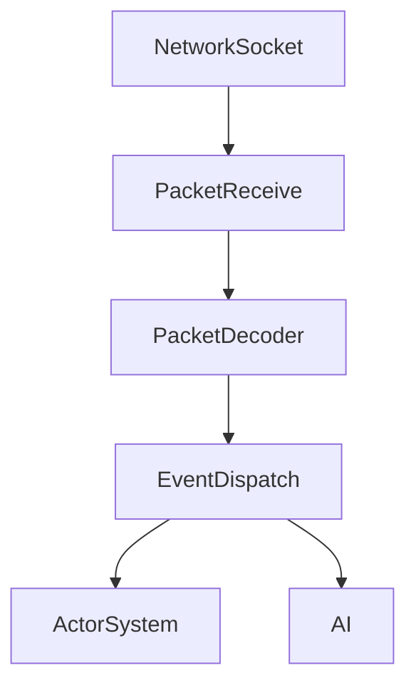

Explanation:

Packets received from the server are decoded and dispatched to the appropriate subsystems.

---

# Plugin Interaction With AI

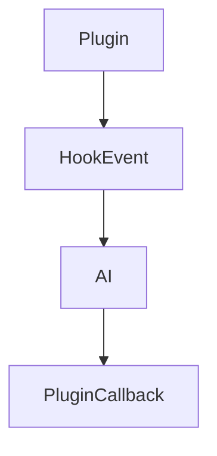

Explanation:

Plugins can intercept AI events and modify behavior dynamically.

---

# Debugging Flow

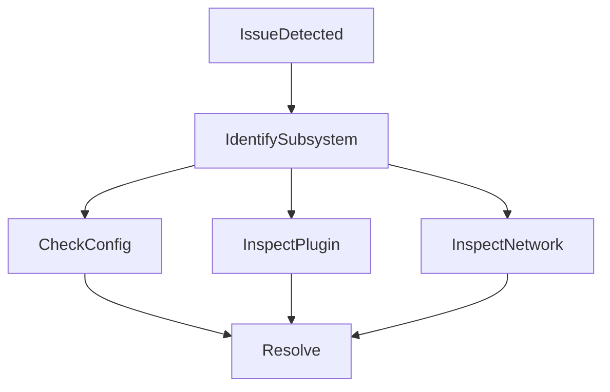

Explanation:

Debugging typically involves identifying which subsystem is responsible for the issue.

---

# Summary

The OpenKore architecture is built around several interacting subsystems:

- AI engine  
- networking pipeline  
- routing system  
- plugin system  
- macro system  
- actor management  

Understanding how these subsystems interact is essential for debugging and extending OpenKore.