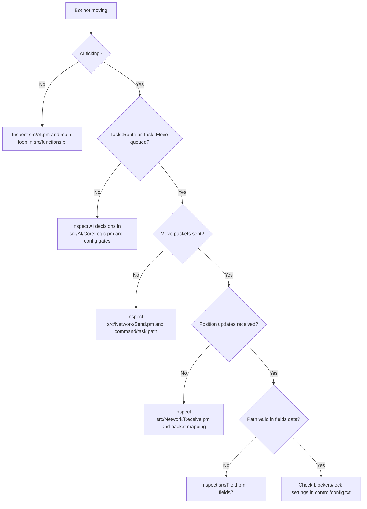
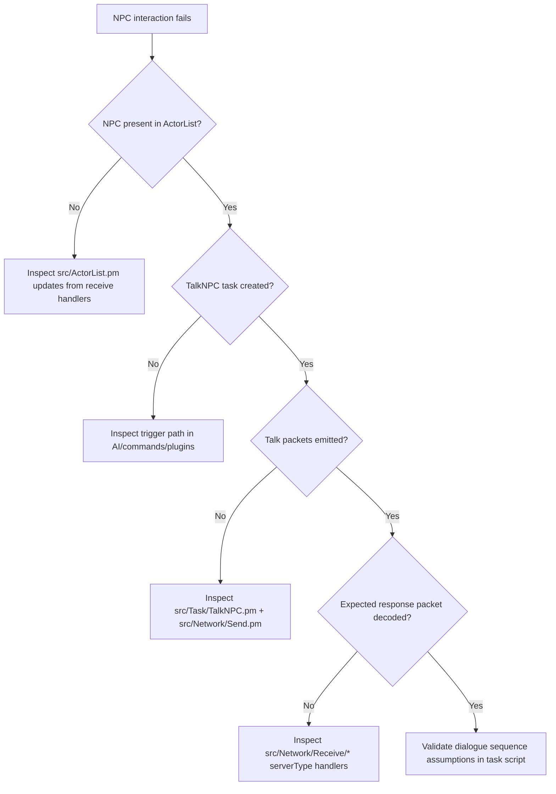
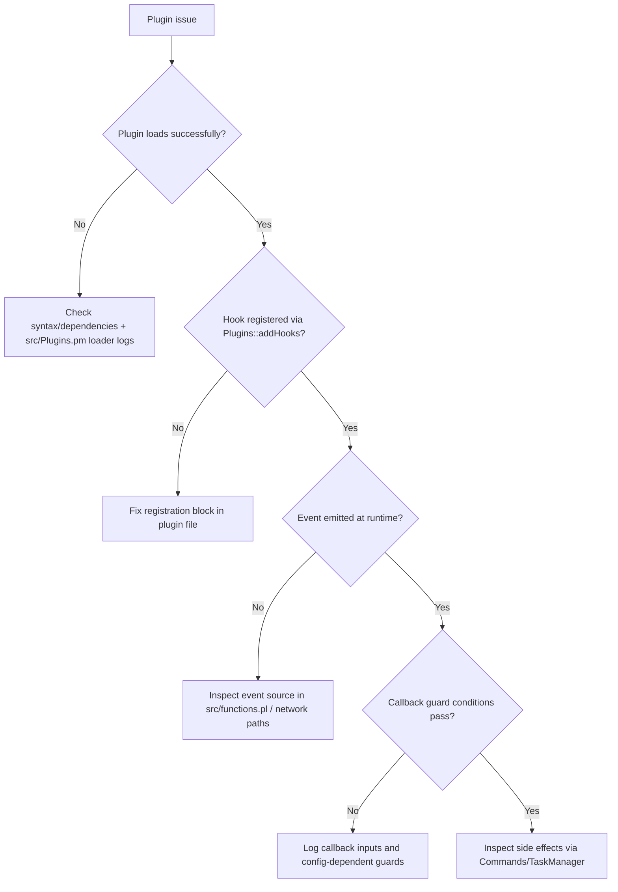
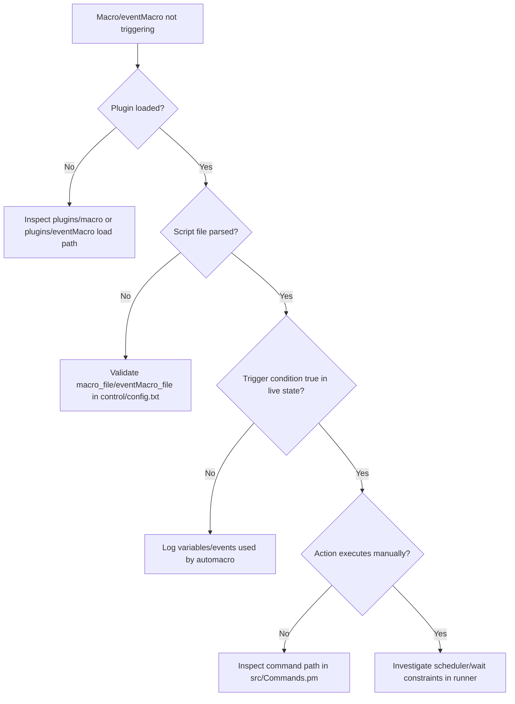
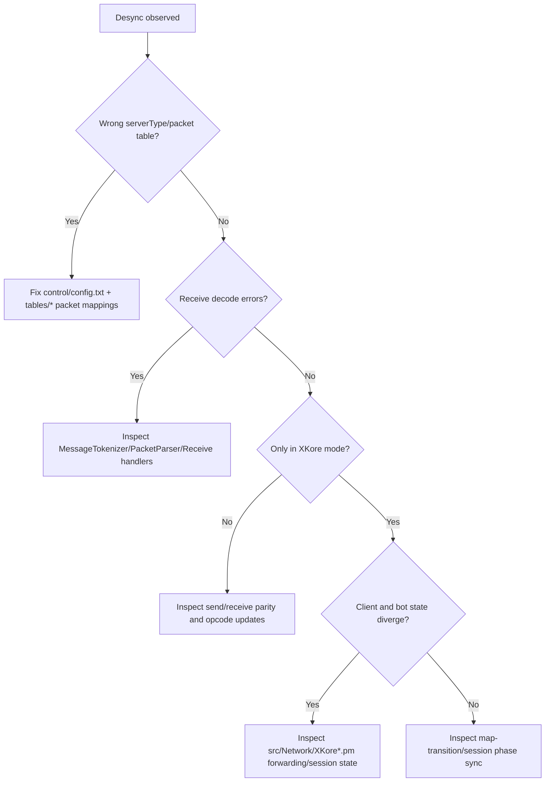

# Debugging Playbook
---

This playbook maps common OpenKore runtime failures to likely causes, inspection points, and step-by-step troubleshooting.

---

## 1) Bot not moving
- **Likely subsystem**: AI + Task + Routing + Network Send
- **Possible causes**:
  - AI state blocked (attack/dialog/task lock)
  - Route task never created or immediately failing
  - Movement packets not being sent or rejected
  - Movement-related config prevents walking
- **Files to inspect**:
  - `src/AI.pm`, `src/AI/CoreLogic.pm`
  - `src/TaskManager.pm`, `src/Task/Move.pm`, `src/Task/Route.pm`
  - `src/Network/Send.pm`, `src/Network/Receive.pm`
- **Config to inspect**:
  - `control/config.txt` (movement/lockMap/route-related options)
  - `control/mon_control.txt` (behavior that can pin combat state)
- **Debugging steps**:
  1. Confirm AI is ticking and not paused/stuck in a higher-priority state.
  2. Check whether `Task::Route`/`Task::Move` is queued in task manager.
  3. Validate that move packets are emitted by send path.
  4. Confirm receive updates are acknowledging position changes.
  5. Reduce constraints in config (lock-only behavior, avoid lists) and retest.

## 2) Routing failure
- **Likely subsystem**: Routing + Field data + Task
- **Possible causes**:
  - Missing/incorrect field data
  - Blocked cells/portal transitions not resolved
  - Route recomputation loops without progress
- **Files to inspect**:
  - `src/Task/Route.pm`, `src/Task/Move.pm`, `src/Field.pm`
- **Config to inspect**:
  - `control/config.txt` (route/move flags)
  - `fields/*` (map walkability data)
- **Debugging steps**:
  1. Verify map field exists and corresponds to current map.
  2. Check route generation result (empty path or oscillating path).
  3. Confirm position updates are fresh (no stale coordinates).
  4. Test shorter route segments to isolate failing region.
  5. Re-check portal/map transition assumptions.

## 3) NPC interaction failure
- **Likely subsystem**: Task + Network Receive/Send + Actor/NPC state
- **Possible causes**:
  - Wrong NPC coordinates or stale actor reference
  - Dialogue step mismatch with server response
  - Talk packets not sent or incorrect sequence
- **Files to inspect**:
  - `src/Task/TalkNPC.pm`
  - `src/Network/Send.pm`, `src/Network/Receive.pm`, `src/Network/Receive/*`
  - `src/ActorList.pm`
- **Config to inspect**:
  - `control/config.txt` (npc interaction directives/scripts)
- **Debugging steps**:
  1. Confirm NPC exists in actor list at expected coordinates.
  2. Trace talk packet send sequence against expected dialogue steps.
  3. Verify receive handlers parse response packet IDs correctly for server type.
  4. Reproduce with minimal NPC script/task to reduce branching.

## 4) Plugin not loading
- **Likely subsystem**: Plugin system + startup/module loading
- **Possible causes**:
  - Syntax/runtime error in plugin file
  - Incorrect plugin path/name
  - Missing dependency module used by plugin
- **Files to inspect**:
  - `src/Plugins.pm`, `src/Modules.pm`
  - `plugins/<plugin_name>/*.pl`
- **Config to inspect**:
  - `control/config.txt` (plugin enable/load entries)
- **Debugging steps**:
  1. Check startup logs for plugin load exceptions.
  2. Validate plugin registers with `Plugins::register`.
  3. Confirm plugin path and filename match expected loader behavior.
  4. Remove optional dependency imports to isolate failing require/use.

## 5) Plugin hook not firing
- **Likely subsystem**: Plugin hooks + event dispatch
- **Possible causes**:
  - Hook registered with wrong event name
  - Hook callback blocked by guard condition
  - Expected event never emitted in current runtime path
- **Files to inspect**:
  - `src/Plugins.pm`, `src/functions.pl`
  - Plugin file defining `Plugins::addHooks`
- **Config to inspect**:
  - `control/config.txt` (conditions controlling event generation)
- **Debugging steps**:
  1. List hooks registered by plugin after load.
  2. Add lightweight logging at callback entry.
  3. Verify event name spelling and payload assumptions.
  4. Trigger event manually through a minimal reproduction path.

## 6) Macro not triggering
- **Likely subsystem**: Macro plugin + command/hook bridge
- **Possible causes**:
  - Macro file not loaded
  - Automacro condition never true
  - Macro command blocked by runtime state
- **Files to inspect**:
  - `plugins/macro/macro.pl`, `plugins/macro/Macro/*`
  - `src/Commands.pm`, `src/Plugins.pm`
- **Config to inspect**:
  - `control/config.txt` (`macro_file` and related keys)
  - macro definition file referenced by config
- **Debugging steps**:
  1. Confirm macro plugin loaded and macro file parsed.
  2. Validate automacro conditions against live state.
  3. Execute macro manually to separate trigger vs action issues.
  4. Inspect command dispatch path for blocked/invalid command.

## 7) eventMacro issues
- **Likely subsystem**: eventMacro plugin + event parser/runner
- **Possible causes**:
  - Invalid eventMacro syntax
  - Trigger conditions not matching event payload
  - Runner stalled by previous action/wait state
- **Files to inspect**:
  - `plugins/eventMacro/eventMacro.pl`
  - `plugins/eventMacro/eventMacro/{Core,Runner,Automacro,FileParser}.pm`
- **Config to inspect**:
  - `control/config.txt` (`eventMacro_file`)
  - eventMacro script file
- **Debugging steps**:
  1. Validate eventMacro file parsing with minimal script.
  2. Log trigger evaluation for target automacro.
  3. Check runner queue and pending wait/time gates.
  4. Reduce script to one trigger + one action and retest.

## 8) Packet desync
- **Likely subsystem**: Networking receive/parser + server-type mappings
- **Possible causes**:
  - Wrong server type packet tables
  - Opcode map mismatch after server update
  - Packet boundary/tokenization errors
- **Files to inspect**:
  - `src/Network/MessageTokenizer.pm`, `src/Network/PacketParser.pm`
  - `src/Network/Receive.pm`, `src/Network/Receive/*`
  - `src/Network/Send.pm`, `src/Network/Send/*`
- **Config to inspect**:
  - `control/config.txt` (serverType/recvpackets settings)
  - `tables/*` packet definition files for the target server
- **Debugging steps**:
  1. Confirm selected serverType and recvpackets data.
  2. Compare failing opcode decode against current server packet definitions.
  3. Capture raw packet sequence around first desync point.
  4. Verify both receive and send side use compatible packet maps.

## 9) XKore sync issues
- **Likely subsystem**: XKore transport/session bridging
- **Possible causes**:
  - Client-proxy handshake mismatch
  - Account/char/map relay state divergence
  - Timing/forwarding issues in XKore mode
- **Files to inspect**:
  - `src/Network/XKore.pm`, `src/Network/XKore2.pm`, `src/Network/XKoreProxy.pm`
  - `src/Network/XKore2/{AccountServer,CharServer,MapServer}.pm`
- **Config to inspect**:
  - `control/config.txt` (XKore mode and connection settings)
- **Debugging steps**:
  1. Confirm active mode (Direct vs XKore/XKore2/XKoreProxy).
  2. Trace handshake/login flow across account->char->map stages.
  3. Check for asymmetric forwarding (client sees state that bot does not, or inverse).
  4. Validate mode-specific ports/bind settings and restart cleanly.

## 10) Visual client state not updating
- **Likely subsystem**: XKore bridge + packet forwarding + actor sync
- **Possible causes**:
  - Forwarded packets not reaching client
  - Actor state updated in bot but not mirrored to client channel
  - Client session stuck after map transition
- **Files to inspect**:
  - `src/Network/XKore*.pm`
  - `src/Network/Receive.pm`, `src/ActorList.pm`
- **Config to inspect**:
  - `control/config.txt` (XKore forwarding/session config)
- **Debugging steps**:
  1. Verify bot-side state is changing (position/actors) first.
  2. Confirm corresponding packets are forwarded to client path.
  3. Re-check session phase (account/char/map) for stuck transition.
  4. Reconnect client through same mode to re-establish synchronization.

# Debug Decision Trees
---

These trees provide fast triage paths for recurring OpenKore failures.

## A) Bot not moving / Routing failure

Use this when movement appears frozen or route tasks fail repeatedly.

## B) NPC interaction failure

Use this when NPC talks stop, loop, or complete with wrong branch.

## C) Plugin not loading / Hook not firing

Use this for both plugin boot failures and silent hooks.

## D) Macro/eventMacro not triggering

Use this to isolate parser issues from trigger logic and action execution.

## E) Packet desync / XKore sync / visual client desync

Use this for protocol mismatches and client-bridge synchronization drift.

# Common Pitfalls
---

Concise checklist of high-frequency debugging traps in OpenKore architecture and operations.

## 1) Assuming movement issues are only routing bugs
- AI state locks, command overrides, or task queue starvation can mimic routing failures.
- Check AI/task state before editing route logic.

## 2) Ignoring serverType/packet table drift
- Packet desync often starts after server updates when recvpackets/opcodes change.
- Keep `control/config.txt` server settings aligned with `tables/*` packet definitions.

## 3) Debugging plugin hooks without proving event emission
- A hook can be correct but never run if the event is not emitted in the current flow.
- Verify both registration and actual event source path.

## 4) Treating macro trigger failures as parser failures
- Many cases are valid parse + false trigger conditions.
- Separate: plugin load -> file parse -> trigger true -> action execution.

## 5) Overlooking config-side constraints
- `control/config.txt`, `mon_control.txt`, and related files can disable or redirect behavior.
- Always test with minimal, known-good config for reproduction.

## 6) Mixing XKore and DirectConnection assumptions
- Transport/session behavior differs; debugging steps are mode-specific.
- Confirm active mode first before tracing packet/session paths.

## 7) Trusting visual client state over bot internal state
- In XKore scenarios, client view may lag/diverge from bot state.
- Compare bot-side actor/position updates with forwarded client packets.

## 8) Investigating deep modules before reproducing minimally
- Large automation stacks (AI + plugin + macro + eventMacro) hide root causes.
- Reproduce with minimal script/task/command to localize fault domain.

## Fast isolation matrix
| Symptom | First subsystem to verify | Primary files |
|---|---|---|
| Bot not moving | AI/Task | `src/AI.pm`, `src/TaskManager.pm` |
| Route fails | Routing/Field | `src/Task/Route.pm`, `src/Field.pm` |
| NPC fails | Task + Receive | `src/Task/TalkNPC.pm`, `src/Network/Receive.pm` |
| Plugin not loading | Plugin loader | `src/Plugins.pm`, plugin file |
| Hook silent | Event dispatch | `src/Plugins.pm`, event source module |
| Macro not triggering | Macro pipeline | `plugins/macro/*`, `src/Commands.pm` |
| eventMacro issues | eventMacro runner | `plugins/eventMacro/eventMacro/*` |
| Packet desync | Packet mapping | `src/Network/PacketParser.pm`, `tables/*` |
| XKore sync issues | XKore bridge | `src/Network/XKore*.pm` |
| Client view stale | XKore forwarding | `src/Network/XKore*.pm`, `src/ActorList.pm` |

# Debugging Guide (Networking and Tables)
---

## 1) Confirm server/profile alignment
- Validate `serverType` and packet profile selection in `control/config.txt`.
- Verify matching packet tables in `tables/*` for the selected server family.

## 2) Trace receive path
- `src/Network/MessageTokenizer.pm` -> `src/Network/PacketParser.pm` -> `src/Network/Receive.pm` -> `src/Network/Receive/*`
- Look for first packet decode mismatch point.

## 3) Trace send path
- Inspect command/task origin, then `src/Network/Send.pm` + `src/Network/Send/*` packet construction.
- Confirm opcode/structure expected by current server profile.

## 4) XKore-specific checks
- Inspect `src/Network/XKore.pm`, `src/Network/XKore2.pm`, `src/Network/XKoreProxy.pm`.
- Validate session phase transitions and packet forwarding symmetry.

## 5) Iterative workflow
1. Reproduce with minimal actions.
2. Isolate receive vs send failure.
3. Validate serverType/packet table pairing.
4. Re-test after one controlled change.
