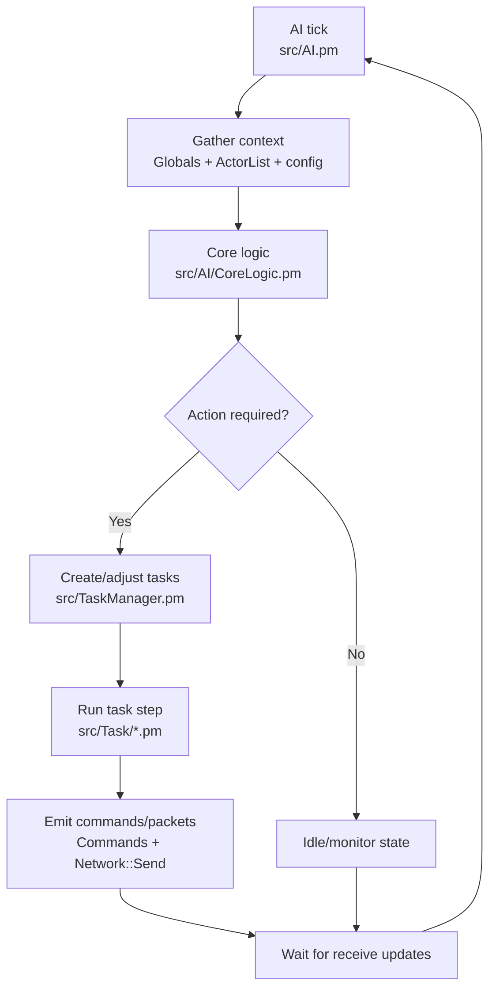
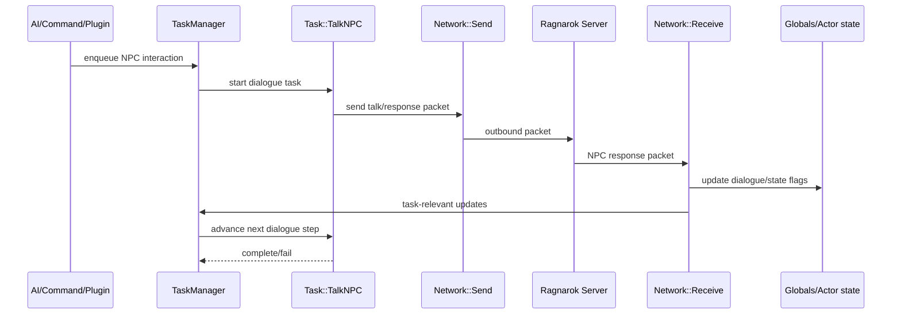
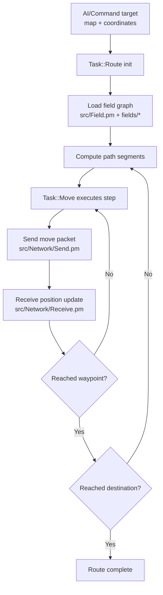
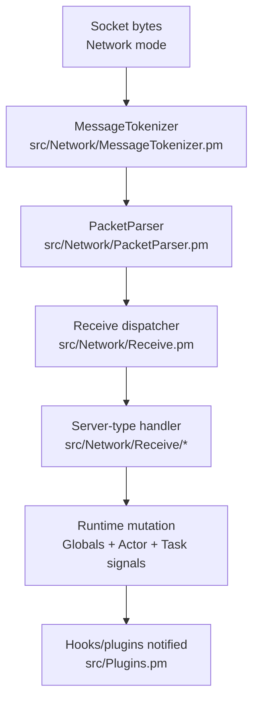
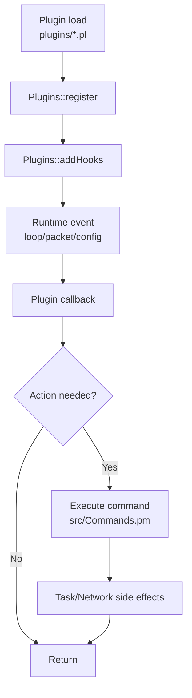
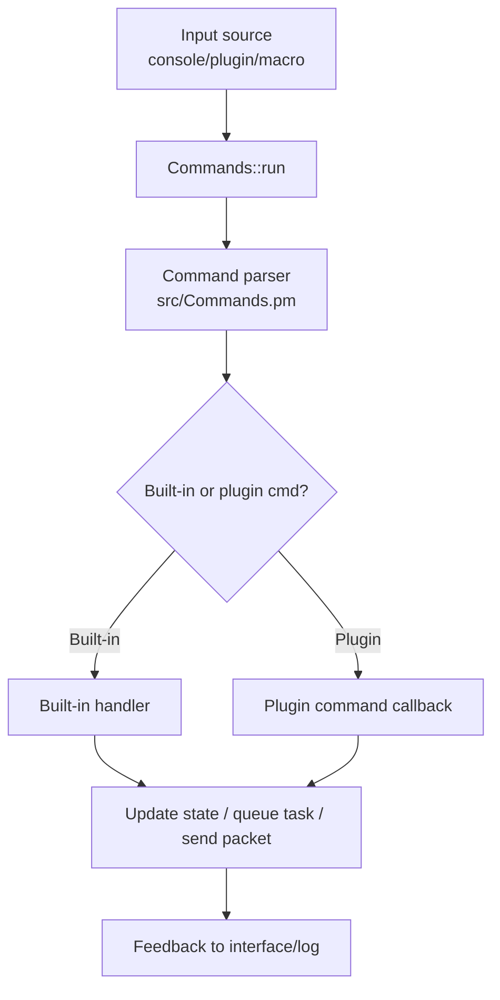

# Execution Flows
---

## Runtime execution loop
OpenKore runs a tick-oriented loop rooted in `src/functions.pl`, where network ingestion, state updates, AI decisions, and task execution are iterated continuously.

Operational sequence:
1. Main loop tick in `src/functions.pl` advances network, AI, and task phases.
2. Receive handlers (`src/Network/Receive.pm`, `src/Network/Receive/*`) apply packet-driven state updates.
3. Shared state (`src/Globals.pm`, `src/ActorList.pm`) becomes input for AI logic.
4. AI (`src/AI.pm`, `src/AI/CoreLogic.pm`) chooses actions and updates task queues.
5. Tasks (`src/TaskManager.pm`, `src/Task/*`) execute stepwise and emit outgoing packets through send modules.

## AI execution loop

AI is decision-oriented; tasks hold execution state between ticks while receive handlers provide feedback.

# NPC Interaction Flow
---

NPC interactions are executed as task-driven conversations, typically using `src/Task/TalkNPC.pm` and packet handlers under `src/Network/Receive/*.pm`.

`Task::TalkNPC` keeps dialogue progression explicit, while receive handlers synchronize server-side conversation state back into runtime state.

# Routing and Movement
---

Routing converts destination intent into path segments and movement packets using `src/Task/Route.pm`, `src/Task/Move.pm`, `src/Field.pm`, and `fields/*` data.

Routing is iterative and feedback-driven: each movement step is validated by receive updates before continuing.

# Networking and Packet Flow
---

OpenKore packet handling combines framing/tokenization, opcode parsing, and server-type receive/send classes under `src/Network/*`.

## Packet receive flow

Receive processing turns protocol frames into domain-level state transitions used by AI and tasks.

## Packet send path (supporting context)
- Action request sources: AI, commands, task modules, plugins/macros.
- Encoding path: `src/Network/Send.pm` -> `src/Network/Send/*` (server-type specific structures).
- Transport path: active mode (`DirectConnection`, `XKore`, `XKore2`, or `XKoreProxy`) in `src/Network/*.pm`.

# XKore Modes
---

XKore modes define how OpenKore connects to the game client/server pipeline.

## Core modules
- `src/Network/XKore.pm`
- `src/Network/XKore2.pm`
- `src/Network/XKoreProxy.pm`
- `src/Network/DirectConnection.pm` (baseline comparison)

## Mode summary
- **DirectConnection**: bot connects directly to game servers.
- **XKore**: client-assisted mode using forwarding/bridging logic.
- **XKore2**: OpenKore hosts local account/char/map proxy endpoints (`src/Network/XKore2/*`) and relays traffic.
- **XKoreProxy**: proxy-style mediation path for packet bridging.

## Architectural impact
- All modes reuse packet parsing/dispatch and send modules (`src/Network/{Receive,Send}.pm`).
- Mode choice primarily changes transport/session orchestration and how packets are sourced/sinked.
- AI, tasks, actor state, plugins, and macro systems remain mode-agnostic above the network abstraction.

# Architecture Diagrams (Mermaid)
---

This file indexes the runtime diagrams for OpenKore subsystem interactions.

## Included diagrams
1. **AI execution loop** — `06_execution_flows.md`
2. **Packet receive flow** — `09_networking_packets.md`
3. **NPC interaction flow** — `07_npc_interaction_flow.md`
4. **Plugin hook execution** — `27_system_flows.md`
5. **Routing and movement flow** — `08_routing_and_movement.md`
6. **Command execution flow** — `27_system_flows.md`

## Reading guidance
- Start with `06_execution_flows.md` for the main runtime cycle.
- Use `09_networking_packets.md` and `10_xkore_modes.md` for transport/protocol context.
- Use `07_npc_interaction_flow.md` and `08_routing_and_movement.md` for task-level behavioral flows.
- Use `27_system_flows.md` for extension and control-plane flows.

# System Flows
---

## Plugin hook execution flow
Plugins extend runtime behavior through hook callbacks registered in `src/Plugins.pm` and commonly invoke `src/Commands.pm` or task APIs.

Hook callbacks are event-driven and should remain lightweight; heavy operations are usually delegated to commands/tasks.

## Command execution flow

Commands are a shared control surface across manual operations, plugins, and macro automation.
