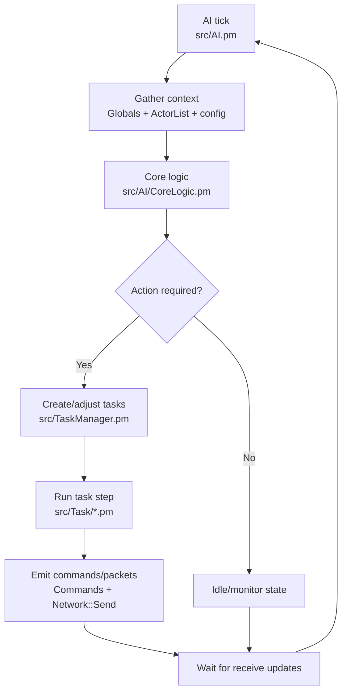

# Execution Flows

## Runtime execution loop
OpenKore runs a tick-oriented loop rooted in `src/functions.pl`, where network ingestion, state updates, AI decisions, and task execution are iterated continuously.

Operational sequence:
1. Main loop tick in `src/functions.pl` advances network, AI, and task phases.
2. Receive handlers (`src/Network/Receive.pm`, `src/Network/Receive/*`) apply packet-driven state updates.
3. Shared state (`src/Globals.pm`, `src/ActorList.pm`) becomes input for AI logic.
4. AI (`src/AI.pm`, `src/AI/CoreLogic.pm`) chooses actions and updates task queues.
5. Tasks (`src/TaskManager.pm`, `src/Task/*`) execute stepwise and emit outgoing packets through send modules.

## AI execution loop

AI is decision-oriented; tasks hold execution state between ticks while receive handlers provide feedback.
