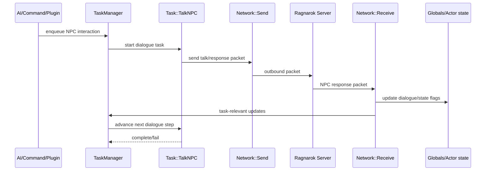

# NPC Interaction Flow

NPC interactions are executed as task-driven conversations, typically using `src/Task/TalkNPC.pm` and packet handlers under `src/Network/Receive/*.pm`.

`Task::TalkNPC` keeps dialogue progression explicit, while receive handlers synchronize server-side conversation state back into runtime state.
