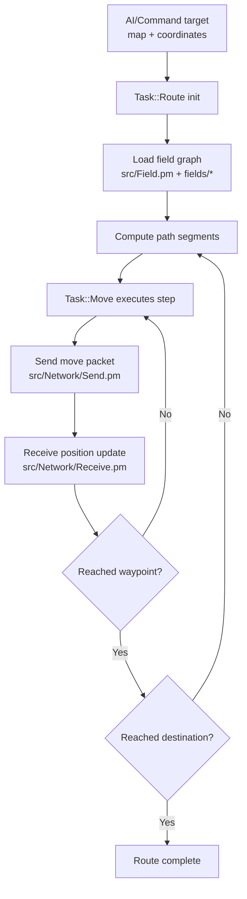

# Routing and Movement

Routing converts destination intent into path segments and movement packets using `src/Task/Route.pm`, `src/Task/Move.pm`, `src/Field.pm`, and `fields/*` data.

Routing is iterative and feedback-driven: each movement step is validated by receive updates before continuing.
