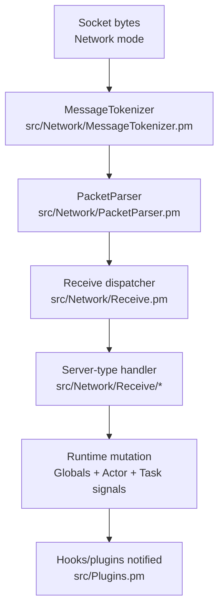

# Networking and Packet Flow

OpenKore packet handling combines framing/tokenization, opcode parsing, and server-type receive/send classes under `src/Network/*`.

## Packet receive flow

Receive processing turns protocol frames into domain-level state transitions used by AI and tasks.

## Packet send path (supporting context)
- Action request sources: AI, commands, task modules, plugins/macros.
- Encoding path: `src/Network/Send.pm` -> `src/Network/Send/*` (server-type specific structures).
- Transport path: active mode (`DirectConnection`, `XKore`, `XKore2`, or `XKoreProxy`) in `src/Network/*.pm`.
