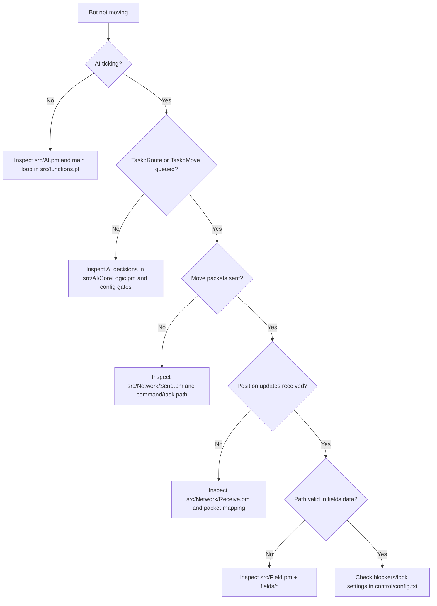
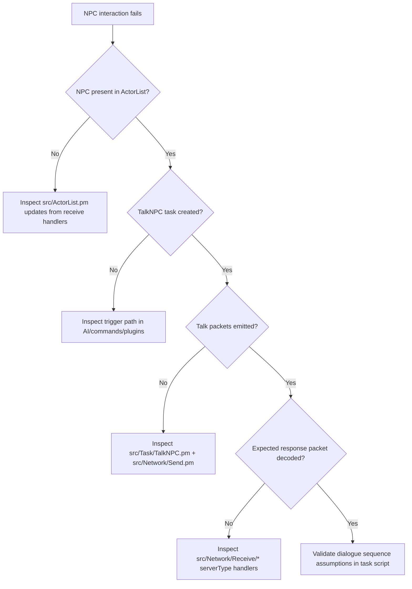
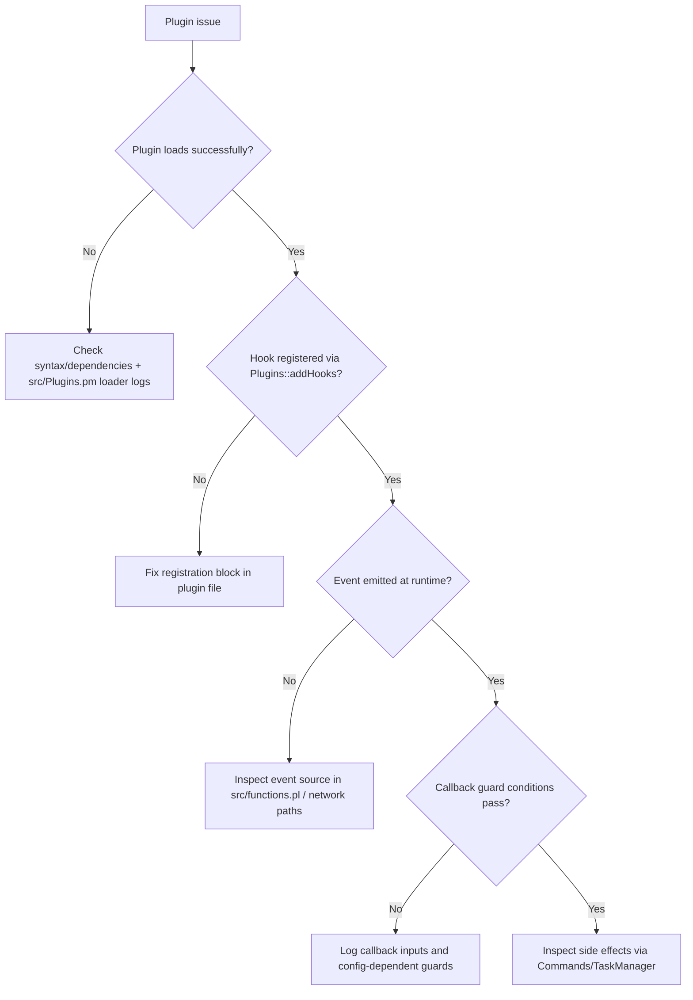
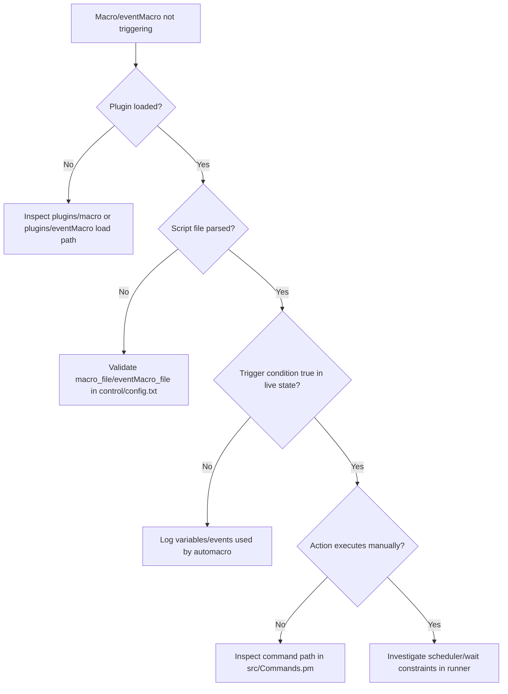
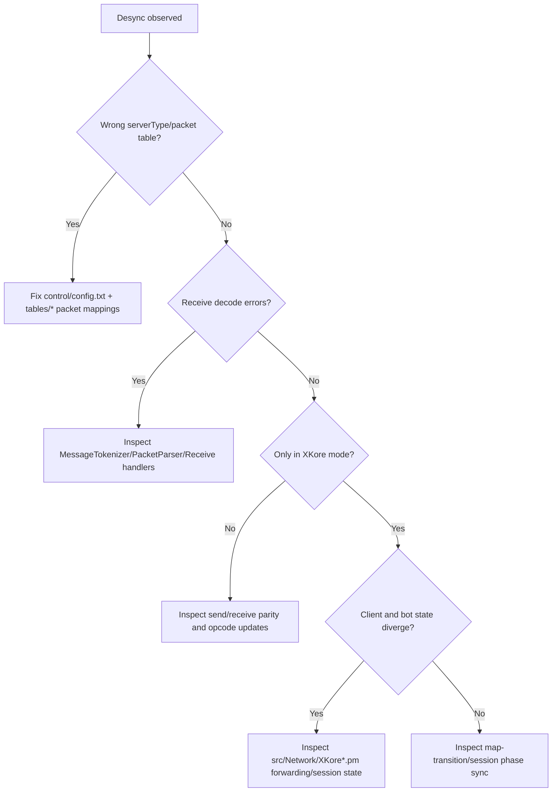

# Debug Decision Trees

These trees provide fast triage paths for recurring OpenKore failures.

## A) Bot not moving / Routing failure

Use this when movement appears frozen or route tasks fail repeatedly.

## B) NPC interaction failure

Use this when NPC talks stop, loop, or complete with wrong branch.

## C) Plugin not loading / Hook not firing

Use this for both plugin boot failures and silent hooks.

## D) Macro/eventMacro not triggering

Use this to isolate parser issues from trigger logic and action execution.

## E) Packet desync / XKore sync / visual client desync

Use this for protocol mismatches and client-bridge synchronization drift.
