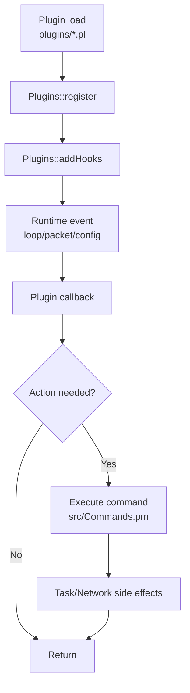
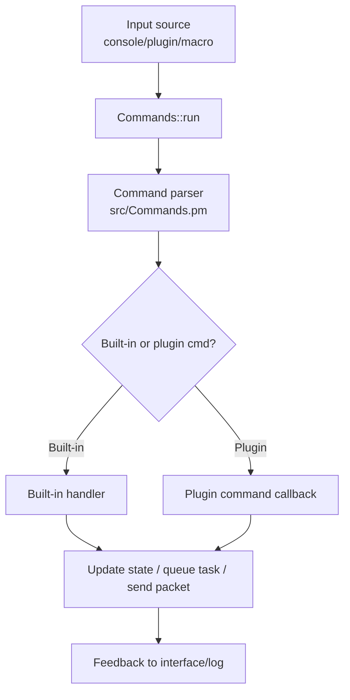

# System Flows

## Plugin hook execution flow
Plugins extend runtime behavior through hook callbacks registered in `src/Plugins.pm` and commonly invoke `src/Commands.pm` or task APIs.

Hook callbacks are event-driven and should remain lightweight; heavy operations are usually delegated to commands/tasks.

## Command execution flow

Commands are a shared control surface across manual operations, plugins, and macro automation.
